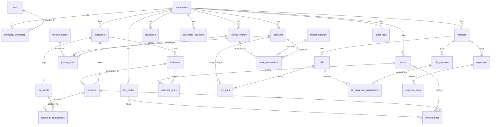

# SPEC.md — "LedgerBook": a QuickBooks-style small-business accounting app

This document is the single source of truth for building the product. Every
decision below is **already made** — do not re-open decisions, do not add
alternatives, do not "improve" the scope. If something is genuinely missing or
contradictory, stop and ask the user; otherwise implement exactly what is
written here.

Target reader: a coding agent starting from an empty repository.

Companion files:
- `CLAUDE.md` — behavioral rules for the implementing agent.
- `TASKS.md` — task breakdown with acceptance criteria, progress state, and
  the decision log. Update it as you work.

Document map:
- §1–§10: product, stack, and feature specifications.
- Appendix A: complete column-level database schema + ERD.
- Appendix B: complete tRPC API contract.
- Appendix C: state machines and exact formulas.
- Appendix D: deterministic seed dataset.

---

## 1. Product summary

LedgerBook is a web-based double-entry accounting application for small
businesses (1–20 employees), functionally modeled on QuickBooks Online. Core
value: track money in (invoices/payments), money out (bills/expenses), keep a
correct double-entry general ledger underneath everything, reconcile against
the bank, and produce the standard financial reports.

### 1.1 In scope (v1)

1. Multi-tenant companies with role-based users, member invitations,
   email verification, password reset
2. Chart of Accounts
3. Customers, Vendors, Products & Services
4. Invoices (A/R) with per-line discounts, PDF rendering, email sending,
   payment recording, customer credits (overpayments) and credit application
5. Estimates (same line editor incl. discounts, convertible to invoices)
6. Bills (A/P), bill payments, vendor credits (overpayments)
7. Expenses (direct money-out transactions)
8. Manual journal entries
9. Bank accounts, CSV transaction import, transaction matching, reconciliation
10. Sales tax (flat-rate tax codes, tax liability report)
11. Reports: Profit & Loss, Balance Sheet, Cash Flow (indirect), Trial
    Balance, General Ledger, A/R Aging, A/P Aging, Sales Tax Liability
12. Dashboard (cash balance, P&L snapshot, overdue invoices, unpaid bills,
    6-month income-vs-expense chart)
13. Audit log of all mutations

### 1.2 Explicitly out of scope (v1 — do not build)

- Payroll
- Inventory quantity tracking / COGS automation (products have prices only)
- Multi-currency (schema stores a currency code, UI is single-currency USD)
- Live bank feeds (Plaid etc.) — CSV import only, behind an interface
- Online payment collection (Stripe) — payments are recorded manually
- Recurring transactions, budgets, projects/classes/locations, time tracking
- Discount **accounts** (contra-income tracking) — discounts reduce income
  directly (§5.7.2); invoice-level (whole-document) discounts — discounts are
  per-line only
- Accountant tools (closing the books, adjusting periods) beyond a simple
  "books closed through DATE" lock
- Cash-basis reporting (accrual only)
- Report period comparisons ("vs previous period")
- Mobile apps; the web UI must be responsive but that's it

---

## 2. Tech stack (fixed decisions)

| Concern | Decision |
|---|---|
| Language | TypeScript, `strict: true` everywhere |
| Framework | Next.js 15, App Router, single app (no separate API service) |
| API layer | tRPC v11 (all mutations/queries go through tRPC routers — full contract in Appendix B) |
| Database | PostgreSQL 16 |
| ORM | Drizzle ORM + drizzle-kit migrations |
| Validation | Zod (shared schemas between tRPC and forms) |
| Auth | Auth.js (NextAuth v5), Credentials (email+password, bcrypt) + Google OAuth |
| UI | Tailwind CSS v4 + shadcn/ui components |
| Tables/forms | TanStack Table, React Hook Form + Zod resolver |
| Charts | Recharts (dashboard bar chart only) |
| CSV parsing | `csv-parse` (bank import), `csv-stringify` (report export) |
| PDF | `@react-pdf/renderer` for invoice/estimate PDFs, generated server-side |
| Email | Resend SDK; in dev, log to console via a `Mailer` interface |
| Money math | Integer **cents** (`bigint` in Postgres, `number` in TS — see §4.1) |
| Dates | `date` columns for business dates, `timestamptz` for audit timestamps; UI uses the company's timezone |
| IDs | UUIDv7 primary keys, generated in the app (`uuidv7` npm package) |
| Package manager | pnpm |
| Unit tests | Vitest |
| E2E tests | Playwright (Chromium only) |
| Lint/format | ESLint + Prettier, default configs, no bikeshedding |
| Local infra | `docker-compose.yml` with Postgres 16 only |
| Deployment target | Any Node host; provide `Dockerfile`. No vendor lock-in features. |

Repository layout (single Next.js app, not a monorepo):

```
/src
  /app                # Next.js routes (route groups: (auth), (app))
  /server
    /db               # drizzle schema, migrations, seed
    /ledger           # posting engine (pure functions + service)
    /services         # invoice, bill, payment, reconciliation, reports...
    /trpc             # routers, context, middleware
    /mail             # Mailer interface + Resend/console impls
  /components         # shared UI
  /lib                # utils (money, dates, numbering)
/tests
  /unit
  /e2e
  /fixtures           # seed dataset (Appendix D), bank CSV fixtures
```

---

## 3. Multi-tenancy, auth, roles

### 3.1 Tenancy model

- Tenant = **Company**. Every business row carries `company_id`.
- A User can belong to many Companies via `company_members`
  (`user_id, company_id, role`).
- The active company is stored in the session; a company switcher lives in
  the top nav.
- **Every** tRPC procedure (except auth/onboarding) runs through a middleware
  that (a) requires a session, (b) resolves active company, (c) verifies
  membership, (d) injects `{ companyId, role }` into context. Queries must
  always filter by `companyId` from context — never trust a client-sent
  company id.

### 3.2 Roles and permissions

Four roles, enforced in tRPC middleware per-procedure (exact mapping of
procedure → minimum role is in Appendix B):

| Role | Can |
|---|---|
| `owner` | Everything, incl. company settings, members, delete company |
| `admin` | Everything except member management and company deletion |
| `accountant` | All accounting features; no company settings/members |
| `viewer` | Read-only: all lists and reports, no mutations |

No custom/granular permissions in v1.

### 3.3 Onboarding

Sign up → create user → "Create your company" form (name, industry free-text,
fiscal year start month, timezone, base currency fixed to USD) → seed the
default Chart of Accounts (§5.2) → land on dashboard. The signing-up user
becomes `owner`.

### 3.4 Credentials flows

- **Signup (credentials)**: email + password (min 10 chars, no other
  composition rules), bcrypt cost 12. On signup, send a verification email
  (§5.15) containing a link `/verify-email?token=...`. Verification is
  **non-blocking**: unverified users can use the app but see a dismissible
  banner "Verify your email" with a resend button (resend rate-limited to 1
  per 5 minutes per user). Tokens: 32 random bytes hex, stored **hashed**
  (sha256) in `verification_tokens`, expire after 24 h, single-use.
- **Google OAuth**: standard Auth.js flow; Google emails are treated as
  verified. Account linking by email: if a Google sign-in matches an existing
  credentials user's verified email, link; if unverified, reject with
  "sign in with your password, verify your email, then connect Google".
- **Password reset**: "Forgot password?" on sign-in → enter email → always
  respond "if that account exists, we sent a link" (no user enumeration).
  Email contains `/reset-password?token=...`. Token: 32 random bytes hex,
  stored hashed in `password_resets`, expires 1 h, single-use (`used_at`
  stamped). Reset invalidates all existing sessions for that user.
- Rate limiting (simple in-memory fixed-window limiter, per IP + per email):
  sign-in 10/min, signup 5/min, password-reset request 3/5min.

### 3.5 Member invitations

- Owner invites by email + role (`admin | accountant | viewer`; owners are
  not invitable — ownership transfer is out of scope, exactly one owner).
- Creates an `invitations` row (token hashed, expires 7 days) and sends the
  invite email (§5.15) with link `/signup?invite=TOKEN`.
- If the invitee already has an account and is signed in with the matching
  email, the link goes to an "Accept invitation" page → joins the company.
  Otherwise the signup form is prefilled with the invited email (locked).
- Accepting: creates `company_members` row, stamps `accepted_at`. Expired or
  used tokens → error page with "ask for a new invitation".
- Owner can revoke pending invitations and resend (resend regenerates the
  token). Owner can remove members and change member roles (not their own).

---

## 4. The ledger core (most important section)

Everything financial in the app is a projection of an immutable double-entry
ledger. Build this first, test it hardest.

### 4.1 Money

- All amounts are integer cents. Postgres `bigint`, TS `number` (safe: max
  business amounts are far below 2^53). Never use floats for money.
- A single `formatMoney(cents, currency)` and `parseMoney(input)` in
  `/src/lib/money.ts`. All UI goes through these.
- Rounding rule everywhere: **half-up** (implement `roundHalfUp(n)` that
  rounds .5 away from zero correctly for negatives: `Math.sign(n) *
  Math.round(Math.abs(n))` applied to the fractional intermediate).
- Discount and tax amounts are computed **per line**, then summed — never
  computed on document totals. Exact line math in §5.7.2 / Appendix C.3.

### 4.2 Accounts (Chart of Accounts)

`accounts` table (full columns in Appendix A):

- `type`: enum `asset | liability | equity | income | expense`
- `subtype`: enum, drives report grouping:
  - asset: `bank | accounts_receivable | current_asset | fixed_asset`
  - liability: `accounts_payable | credit_card | current_liability | long_term_liability | sales_tax_payable`
  - equity: `equity | retained_earnings | owner_equity`
  - income: `income | other_income`
  - expense: `expense | other_expense`
- `is_system boolean` — system accounts (A/R, A/P, Sales Tax Payable,
  Retained Earnings, Undeposited Funds, Opening Balance Equity,
  Reconciliation Discrepancies) cannot be deleted, archived, or re-typed;
  they may be renamed.
- `is_archived boolean` — archive instead of delete once an account has
  postings; accounts with zero postings may be hard-deleted. Archived
  accounts are hidden from pickers but still render in historical reports.
  Archiving is blocked if the account is referenced as a default by an
  active item.

Normal balance: assets/expenses are debit-normal; liabilities/equity/income
are credit-normal. Account balance = `sum(debits) - sum(credits)`, displayed
sign-flipped for credit-normal accounts.

### 4.3 Journal

Two tables (full columns in Appendix A): `journal_entries` and
`journal_lines`.

- `journal_entries.source_type`: enum `invoice | invoice_payment | bill |
  bill_payment | expense | manual | opening_balance |
  reconciliation_adjustment | bank_deposit`
- `source_id`: id of the source document (NULL for `manual`).
- Constraint per line: exactly one of debit/credit is > 0, the other is 0.
- Constraint per entry (enforced in the posting service AND by a deferred
  DB constraint trigger): `sum(debit) = sum(credit)` and ≥ 2 lines.

**Immutability rule:** journal entries are never updated or deleted. Editing
a source document = post a full reversing entry (`reverses_entry_id` set) +
post a new entry. Voiding = reversing entry only. This keeps the audit trail
airtight and makes reports trivially consistent.

### 4.4 Posting engine

`/src/server/ledger/post.ts` exposes one function used by every service:

```ts
postEntry(tx: DbTransaction, input: {
  companyId, entryDate, memo, sourceType, sourceId?,
  lines: Array<{ accountId, debit?, credit?, description?, customerId?, vendorId? }>
}): Promise<JournalEntry>
```

It validates balance, validates accounts belong to the company and aren't
archived, checks the books-closed lock (§4.6), writes entry + lines, and
writes an audit log row — all inside the caller's DB transaction. A sibling
`reverseEntry(tx, entryId, reversalDate, memo)` posts the exact mirror entry
with `reverses_entry_id` set; reversal date = the business date of the edit
or void (defaults to the original entry date; if the original date is inside
a closed period, the reversal date is the day after `books_closed_through`).

There is **no** stored `balance` column anywhere. Balances are always
`SUM` over journal_lines (with indexes on `(account_id)`, and on
`journal_entries (company_id, entry_date)`). If reports become slow later,
that is a later problem — do not add caching/materialized balances in v1.

### 4.5 Posting recipes (exact debits/credits)

Line amounts below are **net of per-line discounts** (§5.7.2).

| Event | Debit | Credit |
|---|---|---|
| Invoice approved/sent (leaves draft) | Accounts Receivable (grand total incl. tax) | Income account per line (line net) + Sales Tax Payable (sum of line tax) |
| Invoice payment received | Deposit-to account: bank or Undeposited Funds (full payment amount) | Accounts Receivable (full payment amount, customer-tagged) |
| Bill created | Expense account per line (net) + Sales Tax Payable (tax on purchases per line) | Accounts Payable (total) |
| Bill payment | Accounts Payable (full payment amount, vendor-tagged) | Bank account |
| Expense (direct) | Expense account per line (+ Sales Tax Payable if tax code set) | Bank/Credit-card account (total) |
| Bank "categorize" money-in (§5.11) | Bank account | Chosen income/other account |
| Customer overpayment | (part of the normal payment entry — the full amount is credited to A/R; the customer's A/R subledger goes negative = customer credit; **no separate entry**) | |
| Vendor overpayment | (mirror: full bill-payment amount debited to A/P; vendor subledger negative = vendor credit) | |
| Applying a credit to a later invoice/bill | **No journal entry** — subledger-only (`payment_applications` / `bill_payment_applications` row). A/R / A/P totals were already correct. | |
| Opening balance on a bank/credit-card account | Bank (or credit Opening Balance Equity if liability) | Opening Balance Equity (or the credit-card account) |
| Reconciliation adjustment | Bank or 6980 Reconciliation Discrepancies | the other one, direction chosen so cleared balance matches the statement |

Accrual basis only in v1.

### 4.6 Books-closed lock

`companies.books_closed_through date NULL`. `postEntry` rejects any entry with
`entry_date <= books_closed_through` (error: "Period is closed"). Only
owner/admin can change the lock date, from company settings. Reversals
triggered by edits/voids of documents dated inside the closed period are
posted on the day after the lock date (§4.4), and the UI warns before doing
so.

---

## 5. Feature specs

### 5.1 Company settings

Name, legal name, address (line1, line2, city, state, postal code, country
default US), phone, email, logo upload (stored as `bytea`, max 1 MB,
png/jpg), fiscal year start month (default January), timezone (IANA name,
default `America/New_York`), invoice numbering prefix (default `INV-`),
estimate prefix (`EST-`), default payment terms (enum: `due_on_receipt |
net_15 | net_30 | net_60`, default `net_30`), books-closed-through date.
Only owner/admin can edit. Company deletion (owner only): type-the-name
confirmation, hard-deletes the tenant and all rows.

### 5.2 Default Chart of Accounts (seeded per company)

Seed exactly these accounts on company creation (code — name — type/subtype;
`[S]` = `is_system`):

- 1000 Checking — asset/bank
- 1050 Undeposited Funds — asset/current_asset [S]
- 1100 Accounts Receivable — asset/accounts_receivable [S]
- 1500 Fixed Assets — asset/fixed_asset
- 2000 Accounts Payable — liability/accounts_payable [S]
- 2100 Credit Card — liability/credit_card
- 2200 Sales Tax Payable — liability/sales_tax_payable [S]
- 3000 Owner's Equity — equity/owner_equity
- 3100 Opening Balance Equity — equity/equity [S]
- 3900 Retained Earnings — equity/retained_earnings [S]
- 4000 Sales — income/income
- 4100 Service Revenue — income/income
- 4900 Other Income — income/other_income
- 5000 Cost of Goods Sold — expense/expense
- 6000 Advertising — expense/expense
- 6100 Bank Fees — expense/expense
- 6200 Insurance — expense/expense
- 6300 Legal & Professional — expense/expense
- 6400 Meals — expense/expense
- 6500 Office Supplies — expense/expense
- 6600 Rent — expense/expense
- 6700 Software — expense/expense
- 6800 Travel — expense/expense
- 6900 Utilities — expense/expense
- 6950 Payroll — expense/expense
- 6980 Reconciliation Discrepancies — expense/expense [S]
- 6990 Other Expense — expense/other_expense

Users can add/edit/archive accounts (CRUD screen with type/subtype pickers);
system accounts are locked as described in §4.2.

### 5.3 Contacts

**Customers**: display name (required, unique per company), company name,
email, phone, billing address (same fields as §5.1), notes, archived flag.
**Vendors**: identical shape. Simple CRUD, searchable list, detail page
showing their transactions (invoices/payments or bills/expenses/payments)
and open balance. Open balance = Σ A/R (or A/P) journal lines tagged with
that contact, sign-adjusted; a negative balance is displayed as "Credit:
$X". Contacts with any transactions can only be archived, never deleted;
transaction-free contacts may be hard-deleted.

### 5.4 Products & Services

`items`: name (unique per company), type (`service | product`), description,
unit price (cents), income account (default 4000 Sales), tax code (nullable →
non-taxable), archived flag. Used to prefill invoice/estimate lines; lines
remain freely editable after insertion (`item_id` kept on the line for
reporting only). Archiving an item never affects existing documents.

### 5.5 Sales tax

`tax_codes`: name (e.g. "CA Sales Tax", unique per company), rate in basis
points (int, e.g. 725 = 7.25%), agency name, archived flag. One tax code per
line (nullable = non-taxable) on invoices, estimates, bills, and expenses.
Tax per line = `roundHalfUp(lineNet * rate_bps / 10000)` where `lineNet` is
net of discount (§5.7.2). All collected tax credits — and all input tax on
bills/expenses debits — the single system account 2200 Sales Tax Payable.
The Sales Tax Liability report groups by tax code over a date range.
"Recording a tax payment" is an Expense posted against 2200 (the UI offers a
"Record tax payment" shortcut on the report that prefills such an expense).
No filing workflows.

### 5.6 Estimates

Statuses: `draft | sent | accepted | declined | converted` (state machine in
Appendix C.1). Same line-item editor as invoices **including per-line
discounts**. **No journal postings ever** — estimates are non-posting
documents. Estimate numbers: `EST-` prefix + zero-padded 6-digit per-company
sequence (own counter, `document_counters.kind = 'estimate'`), editable,
unique per company. Optional expiry date (no automation on expiry — display
only). "Convert to invoice" copies all lines verbatim into a new **draft**
invoice (customer, memo, lines with qty/price/discount/tax), stamps
`converted_invoice_id`, sets status `converted`. PDF + email sending like
invoices (§5.7.5, §5.15). Estimates may be deleted (hard) in any status
except `converted`.

### 5.7 Invoices

#### 5.7.1 Fields

Customer (required), issue date (default today in company tz), terms (enum
from §5.1, default from company settings), due date (derived from terms:
`due_on_receipt` = issue date, `net_N` = issue date + N days; editable
afterwards), invoice number (auto: prefix + zero-padded 6-digit per-company
sequence, e.g. `INV-000042`; editable but unique per company), memo
(printed on PDF), lines (≥ 1 required to leave draft).

#### 5.7.2 Line item math (exact, applies to invoices AND estimates)

Line fields: item (optional), description, quantity (max 3 decimal places,
stored as integer **thousandths**), unit price (cents), discount percent
(stored as basis points `discount_bps`, integer 0–10000, default 0), tax
code (nullable).

```
lineGross     = roundHalfUp(quantity_thousandths * unit_price_cents / 1000)
lineDiscount  = roundHalfUp(lineGross * discount_bps / 10000)
lineNet       = lineGross - lineDiscount          // stored as `amount`
lineTax       = tax_code ? roundHalfUp(lineNet * rate_bps / 10000) : 0

subtotal       = Σ lineGross
discount_total = Σ lineDiscount
tax_total      = Σ lineTax
total          = subtotal - discount_total + tax_total
```

Discounts reduce the income credited per line (income is posted at
`lineNet`); there is **no** contra-income discount account (§1.2). The PDF
and the on-screen document show each line's discount % and a "Discount"
total row when `discount_total > 0`.

#### 5.7.3 Lifecycle

Statuses **stored**: `draft | open | paid | voided`. Display statuses
**derived at read time, never stored**: `partial` (open AND
`amount_paid > 0`), `overdue` (open AND due date < today in company tz —
shown alongside partial when both apply). Full state machine in Appendix
C.1.

- **Draft**: no journal entry. Fully editable. Deletable (hard).
- **Approve** (or first **Send**): posts the §4.5 invoice entry
  (`source_type = 'invoice'`), status → `open`.
- **Edit while open**: reverse + repost (§4.4); recompute totals; blocked if
  the new total would be less than `amount_paid` (error: "Unapply payments
  first").
- **Paid**: set automatically when `amount_paid == total` (via payment
  application); reverts to `open` if an application is removed.
- **Void**: allowed from `open` only, and only when `amount_paid == 0`
  (unapply payments first). Posts the reversing entry; keeps the number.
  Voided invoices are read-only forever.
- Invoices with `amount_paid > 0` cannot be voided or deleted.

#### 5.7.4 Receive payment & customer credits

"Receive payment" flow: pick customer → form shows payment date (default
today), amount, deposit-to account (any `bank` subtype account or 1050
Undeposited Funds), reference (free text, e.g. check #), and the customer's
open invoices (oldest due date first) with amount-to-apply inputs
(auto-filled oldest-first from the payment amount; user can redistribute;
each application ≤ that invoice's remaining balance; Σ applications ≤
payment amount).

- Posts ONE journal entry for the full amount (§4.5), regardless of how many
  invoices it covers. Applications live in `payment_applications`.
- `payments.unapplied_amount = amount − Σ applications`. If > 0 after saving,
  that is a **customer credit** — allowed and shown on the customer page and
  in Receive Payment as "Available credit: $X".
- **Applying credit later**: the Receive Payment screen lists the customer's
  payments with `unapplied_amount > 0`; the user can apply credit to open
  invoices (creates `payment_applications` rows against the old payment; no
  journal entry — §4.5). A payment of $0 combined with credit application is
  valid (pure credit application; no journal entry at all).
- Editing a payment (date/amount/account) = reverse + repost + revalidate
  applications. Deleting a payment reverses its entry and deletes its
  applications (affected invoices recompute `amount_paid`/status). If any of
  the payment's journal lines are reconciled, show the reconciled warning
  (§5.11) before proceeding.

#### 5.7.5 PDF (invoices and estimates; same layout, different heading)

Rendered server-side with `@react-pdf/renderer`, US Letter. Required
content, top to bottom:

1. Header: company logo (if any, max height 60 pt) left; document title
   ("INVOICE" / "ESTIMATE") + number, issue date, due date (or expiry date
   for estimates), terms — right.
2. Company block: name, address, phone, email.
3. "Bill to": customer display name, company name, billing address.
4. Line table columns: Description · Qty · Rate · Discount % (column omitted
   when every line's discount is 0) · Tax (code name or "—") · Amount
   (lineNet).
5. Totals block (right-aligned rows): Subtotal · Discount (omit if 0) ·
   per-tax-code tax rows ("CA Sales Tax (7.25%)") · Total · Amount Paid
   (invoices only, omit if 0) · **Balance Due** (bold).
6. Memo (if any), then footer: "Thank you for your business."

No theming/customization beyond the logo in v1.

### 5.8 Bills & bill payments

Mirror image of invoices with vendors and A/P, with these deliberate
differences: bill lines are **amount-based** (no quantity/unit-price/item)
and have **no discount field** — a bill line is: expense account (picker,
any expense/other_expense/fixed_asset/cost account — concretely: any
non-system account of type `expense` or subtype `fixed_asset`), description,
amount (cents), optional tax code. `tax_total = Σ roundHalfUp(amount *
rate_bps / 10000)` per line; `total = subtotal + tax_total`.

- Fields: vendor (required), bill number (vendor's reference, free text, NOT
  auto-numbered, uniqueness not enforced), issue date, terms, due date
  (derived like invoices), memo, lines (≥ 1).
- **No draft state**: bills post their journal entry (§4.5) on creation.
  Statuses stored: `open | paid | voided`; derived: `partial`, `overdue`
  (same rules as invoices). Edit while open = reverse + repost (blocked if
  new total < amount_paid). Void: only when `amount_paid == 0`.
- **Pay bills** flow mirrors Receive Payment exactly: pick vendor → payment
  date, amount, payment account (any `bank` subtype account), reference →
  apply across open bills oldest-first. One journal entry per payment
  (§4.5). Overpayment ⇒ `bill_payments.unapplied_amount > 0` = **vendor
  credit**, applied later from the same screen, subledger-only, mirroring
  §5.7.4 in every respect (including $0-payment pure credit application and
  delete/edit semantics).

### 5.9 Expenses

One-step money-out: payee (vendor picker, optional; or free-text payee
name), payment account (any `bank` or `credit_card` subtype account), date,
reference, memo, lines (≥ 1): expense account (same picker rule as bill
lines), description, amount, tax code optional. Totals like bills. Posts
immediately per §4.5 (`source_type = 'expense'`). Statuses: `posted |
voided`. Edit = reverse + repost. Void = reverse. No payments/applications.
This is also how sales-tax payments (line account = 2200) and owner draws
(line account = 3000) are recorded.

### 5.10 Manual journal entries

Full editor: date, memo, N ≥ 2 lines with account / debit / credit /
description / optional customer-or-vendor tag. Client-side live balance
indicator and server-side balance check. Accountant, admin, or owner only.
Edit = reverse + repost; the detail page shows the entry's reversal chain
(original → reversed-by → replacement). Manual entries may not post to 1100
A/R or 2000 A/P **unless** a customer (for A/R) or vendor (for A/P) tag is
set on that line (keeps subledgers meaningful).

### 5.11 Banking: import, matching, reconciliation

`bank_transactions` is a staging area, NOT ledger data (columns in
Appendix A). `amount` is signed: positive = money in.

**CSV import** (`/banking/[accountId]/import`, wizard, 3 steps):

1. Upload CSV (≤ 1 MB, ≤ 5,000 rows). Parse with `csv-parse`
   (`relax_column_count: true`, BOM-tolerant).
2. Map columns: date, description, and either a single signed amount column
   or a debit/credit column pair (debit column = money out = negative).
   Date format picker: `MM/DD/YYYY | DD/MM/YYYY | YYYY-MM-DD`. Live preview
   of the first 10 parsed rows. Rows that fail to parse are listed and
   skipped, never imported silently.
3. Commit: creates an `import_batches` row + `bank_transactions` rows.
   Duplicate protection: `fingerprint = sha256(accountId + '|' + isoDate +
   '|' + amountCents + '|' + lowercased, whitespace-collapsed description)`;
   unique per account; duplicates are skipped and counted in the result
   summary ("42 imported, 3 duplicates skipped, 1 unparseable").

Import is implemented behind a `BankFeedSource` interface
(`fetchTransactions(accountId, params): NormalizedBankTxn[]`) with the CSV
implementation as the only v1 source — do not build Plaid.

**Matching screen** (`/banking/[accountId]`): tabs `For review (n) |
Matched | Excluded`. Each unmatched row offers:

1. *Match* — candidate journal lines on that account with exact amount
   (sign-adjusted: money-in candidates are debits to the bank account) and
   entry date within ±7 days of `txn_date`, not already matched to another
   bank transaction. User confirms one → status `matched`,
   `matched_entry_id` set.
2. *Categorize* — inline mini-form. Money out ⇒ creates an Expense (§5.9)
   prefilled (payee guess = description, amount, date, payment account =
   this account) with a category picker; money in ⇒ posts a `bank_deposit`
   entry (debit this account, credit a chosen income/other_income/equity
   account, customer tag optional). Then auto-matches the row to it.
3. *Exclude* — status `excluded` (e.g. transfers already recorded).
   Restorable.

*Unmatch* reverts a matched row to unmatched (does NOT touch the ledger —
if the user wants the categorized expense gone they void it separately).

**Reconciliation** (`/banking/[accountId]/reconcile`): inputs = statement
end date + statement ending balance (cents; for credit cards, enter the
statement balance as negative if the card is owed money — the UI hint
explains this). Screen lists all journal lines on the account with entry
date ≤ statement date and `reconciled_reconciliation_id IS NULL`, each with
a checkbox. Header shows: statement ending balance, cleared balance
(= last completed reconciliation's ending balance + Σ ticked lines,
sign-adjusted), and difference. Ticks are client-state only — nothing
persists until Finish. **Finish** is enabled when difference = 0; if the
user clicks "Finish with adjustment" instead, a `reconciliation_adjustment`
entry (§4.5) for the residual is posted and auto-ticked. Completing writes
a `reconciliations` row and stamps `reconciled_reconciliation_id` on all
ticked lines, atomically. Reconciled lines' entries can still be
reversed/edited, but every such action shows a blocking confirm dialog
("This transaction was reconciled on DATE. Changing it will unbalance your
reconciliation."). Past reconciliations are listed with their statement
date/balance and a read-only detail of stamped lines.

### 5.12 Reports

All reports: date-range picker (presets: This month, Last month, This
quarter, This year, Last year, Custom; default = current **fiscal** year to
date per Appendix C.4), on-screen HTML table, "Export CSV" button
(`csv-stringify`, same rows/columns as the screen). Company timezone
applies to "today".

1. **Profit & Loss** — sections in order: Income (subtype `income`), Cost of
   Goods Sold (account 5000 and any account named under it — concretely:
   type expense whose code starts with `5`), Gross Profit (Income − COGS),
   Expenses (subtype `expense`, excluding COGS block), Other Income, Other
   Expense, **Net Income**. Rows = accounts with nonzero activity in range;
   each row links to the General Ledger filtered to that account + range.
2. **Balance Sheet** — as of a single date (range picker collapses to one
   "As of" date). Assets / Liabilities / Equity grouped by subtype in the
   §4.2 order. Equity section includes two computed rows per Appendix C.4:
   Retained Earnings and Net Income. Total assets vs liabilities+equity
   MUST balance; render a red error banner with both totals if not (that's
   a bug).
3. **Cash Flow (indirect)** — over a range. Layout: Net Income; Operating
   adjustments (Δ in accounts_receivable, current_asset, accounts_payable,
   sales_tax_payable, current_liability); Investing (Δ fixed_asset);
   Financing (Δ long_term_liability, equity, owner_equity,
   retained_earnings postings); Net cash change; Cash at start; Cash at
   end. "Cash" = subtypes `bank` + `credit_card`. Sign rules and the
   self-check assertion are in Appendix C.5; on mismatch render the red
   error banner.
4. **Trial Balance** — as of a date: every account with nonzero balance,
   Debit/Credit columns, totals row; totals must be equal.
5. **General Ledger** — journal lines for a date range, grouped by account,
   with running balance per account; filterable to one account. Columns:
   Date · Entry memo · Line description · Source (linked to the document) ·
   Debit · Credit · Balance.
6. **A/R Aging** / **A/P Aging** — as of a date. Rows = customers/vendors
   with open balances; columns = Current · 1–30 · 31–60 · 61–90 · 90+ ·
   Total (bucket rules in Appendix C.6). Cell click-through to the filtered
   invoice/bill list.
7. **Sales Tax Liability** — per tax code over a range: Taxable sales (Σ
   lineNet of lines with that code on posted invoices), Tax collected, Tax
   on purchases (from bills/expenses), Payments applied to 2200, Balance.
   Plus the "Record tax payment" shortcut (§5.5).

Report engine: one shared query helper returning `Map<accountId, {debits,
credits}>` for a date range, and one for as-of balances. Reports are pure
functions over those maps — unit-test them heavily against the Appendix D
fixture.

### 5.13 Dashboard

Cards: total cash (Σ balances of `bank` subtypes — credit cards NOT
included here), P&L this-month snapshot (income, expenses, net), overdue
invoices (count + total, links to invoice list filtered `overdue`), unpaid
bills (count + total), recent activity (last 10 audit events), and a
6-month income-vs-expense grouped bar chart (Recharts, current month and 5
prior).

### 5.14 Audit log

`audit_logs` (columns in Appendix A) written by every mutating service in
the same transaction. `action` strings are `entity.verb`, e.g.
`invoice.created`, `invoice.approved`, `invoice.voided`, `payment.applied`,
`member.role_changed`, `company.books_closed_changed`. `payload` = JSON
snapshot of the changed fields (`{before, after}` for updates). Read-only
screen for owner/admin with filters: user, entity type, date range;
paginated per §7.1.

### 5.15 Emails (all via the `Mailer` interface)

Common: from `LedgerBook <no-reply@DOMAIN>`, reply-to = company email when
sending documents. Plain HTML (simple inline-styled template, logo omitted
in v1). Templates (subject / body essentials):

| Email | Subject | Body must contain |
|---|---|---|
| Invoice send | `Invoice {number} from {companyName}` | Greeting with customer name, total, due date, "invoice attached" note; PDF attached as `{number}.pdf` |
| Estimate send | `Estimate {number} from {companyName}` | Same shape, expiry date if set; PDF attached |
| Email verification | `Verify your email` | Verify link (24 h expiry noted) |
| Password reset | `Reset your password` | Reset link (1 h expiry noted), "ignore if you didn't request this" |
| Member invitation | `{inviterName} invited you to {companyName} on LedgerBook` | Role, accept link (7 day expiry noted) |

Sending an invoice/estimate stamps `sent_at` (first send) and writes an
audit event on every send.

---

## 6. Data model

The complete column-level schema, all relationships, and the ERD are in
**Appendix A** — implement the Drizzle schema by transcribing it exactly
(names, types, nullability, uniques, FKs, indexes). Summary of principles:

- All tables have `id uuid pk` (UUIDv7), `created_at timestamptz`; mutable
  tables also have `updated_at`; business tables have `company_id` FK +
  index. `journal_entries`/`journal_lines`/`audit_logs` are append-only (no
  `updated_at`).
- Document tables store denormalized totals (`subtotal, discount_total,
  tax_total, total, amount_paid`) — these are **document** state for
  lists/UX; the ledger remains the accounting truth, and a consistency unit
  test asserts document totals equal their journal postings.
- Deletion policy: hard-delete only drafts, estimates, unposted staging data
  (bank transactions, invitations), and transaction-free contacts/accounts/
  items; everything posted is void/archive.

---

## 7. UX map (routes)

```
/(auth)/signin, /signup, /forgot-password, /reset-password, /verify-email
/(app)/onboarding                # create first company
/(app)/dashboard
/(app)/sales/invoices, /invoices/new, /invoices/[id], /invoices/[id]/edit
/(app)/sales/estimates (same pattern)
/(app)/sales/payments/new        # receive payment (+ ?customerId= prefill)
/(app)/sales/customers, /customers/new, /customers/[id]
/(app)/purchases/bills, /bills/new, /bills/[id], /bills/[id]/edit
/(app)/purchases/bill-payments/new
/(app)/purchases/expenses, /expenses/new, /expenses/[id], /expenses/[id]/edit
/(app)/purchases/vendors, /vendors/new, /vendors/[id]
/(app)/banking/[accountId]       # matching screen
/(app)/banking/[accountId]/import
/(app)/banking/[accountId]/reconcile
/(app)/accounting/chart-of-accounts
/(app)/accounting/journal-entries, /journal-entries/new, /journal-entries/[id]
/(app)/reports                   # index of report cards
/(app)/reports/profit-and-loss, /balance-sheet, /cash-flow, /trial-balance,
        /general-ledger, /ar-aging, /ap-aging, /sales-tax
/(app)/settings/company, /settings/members, /settings/taxes, /settings/items,
        /settings/audit-log
/accept-invitation               # invitation landing (auth-aware)
```

Left sidebar nav: Dashboard, Sales (Invoices, Estimates, Customers),
Purchases (Bills, Expenses, Vendors), Banking (one entry per bank/credit-card
account), Accounting (Chart of Accounts, Journal Entries), Reports, Settings.
Global "+ New" button in the top bar: Invoice, Estimate, Receive payment,
Expense, Bill, Pay bills, Journal entry, Customer, Vendor.

### 7.1 List views (columns, default sort, filters, pagination, empty states)

**Pagination (global rule)**: offset-based, 50 rows/page, page controls at
the bottom, server returns `{rows, totalCount}`. All list procedures accept
`{page, search?, ...filters}`.

**Search (global rule)**: case-insensitive `ILIKE %term%` over the columns
noted below.

| List | Columns (in order) | Default sort | Filters | Search over |
|---|---|---|---|---|
| Invoices | Number · Customer · Issue date · Due date · Status badge · Total · Balance due | Issue date desc | Status (all/draft/open/partial/overdue/paid/voided), customer, date range | number, customer name |
| Estimates | Number · Customer · Issue date · Expiry · Status · Total | Issue date desc | Status, customer | number, customer name |
| Customers | Name · Company · Email · Phone · Open balance | Name asc | Archived toggle | name, company, email |
| Vendors | same as customers with A/P balance | Name asc | Archived toggle | name, company, email |
| Items | Name · Type · Price · Income account · Tax code | Name asc | Archived toggle, type | name |
| Bills | Vendor · Bill # · Issue date · Due date · Status · Total · Balance due | Due date asc | Status, vendor, date range | bill #, vendor name |
| Expenses | Date · Payee · Payment account · Total · Status | Date desc | Account, vendor, date range | payee, memo |
| Journal entries | Date · Memo · Source type · Debit total · Created by | Date desc | Source type, date range | memo |
| Chart of accounts | Code · Name · Type · Subtype · Balance | Code asc (nulls last), then name | Type, archived toggle | name, code |
| Bank txns (For review) | Date · Description · Amount (money-in green/money-out plain) · Actions | Date desc | — (tabs are the filter) | description |
| Audit log | Time · User · Action · Entity | Time desc | User, entity type, date range | action |

**Status badges**: draft = gray, open = blue, partial = amber, overdue =
red, paid = green, voided = gray-strikethrough, sent = blue, accepted =
green, declined = red, converted = purple.

**Empty states (global rule)**: one sentence + primary CTA. E.g. invoices:
"No invoices yet." + [Create your first invoice]; bank For-review tab: "All
caught up." + [Import transactions]. Every list in the table above gets
one; wording may vary, shape may not.

**Money display**: `$1,234.56`; negatives as `-$1,234.56` (no parentheses);
right-aligned in tables.

Keep UI plain shadcn/ui defaults — no custom design system work.

---

## 8. Quality bar & testing

1. **Ledger invariants (unit, Vitest)** — the non-negotiables:
   - every posted entry balances; unbalanced input throws
   - reversal produces exact mirror; net effect zero
   - trial balance always sums to zero for any seeded scenario
   - balance sheet equation holds after every scripted operation sequence
   - money/rounding functions: exhaustive edge cases (negatives, thousandth
     quantities, 1-cent rounding, 100% discounts, 0% tax)
   - line math (§5.7.2): property-style tests across qty/price/discount/tax
     grids
2. **Service tests** — invoice lifecycle (draft→open→partial→paid→void
   rules), bill lifecycle, payment over/under-application, credit
   application (customer AND vendor), $0-payment credit application,
   books-closed rejection AND the closed-period reversal-date rule (§4.4),
   invoice-number concurrency (two parallel creates get distinct numbers),
   CSV duplicate fingerprinting, reconciliation completion atomicity,
   tenant isolation (company A cannot read/post company B data — test at
   the tRPC layer for at least one procedure per router).
3. **E2E (Playwright)** — one happy path: sign up → onboard → create
   customer → create+approve invoice (with a discounted line) → receive
   payment → import bank CSV → match payment → run P&L and Balance Sheet
   and assert on-screen numbers.
4. **Deterministic seed** — `pnpm db:seed` loads the **fixed, hand-written**
   dataset defined in Appendix D from `tests/fixtures/seed-data.ts`. No
   randomness anywhere in seeding (no `Math.random`, no `Date.now`-derived
   values; "today" for the seed is pinned to `2026-06-30`). Unit tests
   cross-check report outputs against totals computed independently from
   the fixture objects (not via the ledger), so expected values never need
   hand-maintenance but determinism is guaranteed.
5. CI: GitHub Actions — lint, typecheck, unit tests, e2e against dockerized
   Postgres. All green before any PR merges.

Definition of done for any feature: implemented per this spec, covered by the
tests named above, seed data exercises it, and the relevant report reflects it
correctly.

---

## 9. Build order (milestones)

Build strictly in this order; each milestone ends with green tests. The
task-level breakdown with acceptance criteria lives in `TASKS.md`.

- **M0 Scaffold**: Next.js + tRPC + Drizzle + Auth.js + docker-compose,
  CI, empty shell with nav.
- **M1 Tenancy & auth**: signup, email verification, password reset,
  company onboarding, invitations, members/roles, middleware, settings
  page, audit log plumbing.
- **M2 Ledger core**: chart of accounts (+ seed), posting engine, manual
  journal entries, books-closed lock, trial balance + general ledger.
- **M3 Sales**: customers, items, tax codes, invoices (full lifecycle incl.
  discounts), estimates + conversion, receive payment + credits, PDF +
  email, A/R aging.
- **M4 Purchases**: vendors, bills, bill payments + vendor credits,
  expenses, A/P aging.
- **M5 Banking**: CSV import, matching, categorize, reconciliation.
- **M6 Reporting & polish**: P&L, balance sheet, cash flow, sales tax
  liability, dashboard, seed script (Appendix D), full E2E, README.

---

## 10. Error handling & conventions

- All tRPC errors are typed `TRPCError` with user-safe messages; the UI
  shows them in toasts. Never leak SQL or stack traces to the client.
- Every multi-write operation runs in a single Postgres transaction.
- Concurrency: document numbering via `SELECT ... FOR UPDATE` on
  `document_counters`; posting engine relies on `read committed` +
  explicit locks where noted; no optimistic-locking columns in v1.
- Timezone: business dates are plain `date`; "today" is computed in the
  company timezone (use `Intl.DateTimeFormat` with the company tz — no
  moment/dayjs dependency; a `src/lib/dates.ts` owns all date logic).
- Accessibility: use shadcn/ui semantics, label every form field; no
  further a11y work in v1.
- Security: bcrypt (cost 12), session cookies httpOnly/secure, CSRF handled
  by Auth.js, all uploads size/type-checked, rate limits per §3.4, all
  tokens stored hashed.

---

---

# Appendix A — Database schema (complete)

Transcribe this into Drizzle exactly. Conventions: `pk` = uuid primary key
(UUIDv7, app-generated); `ts` = `timestamptz not null default now()`;
`FK→x` = foreign key with an index; all FKs `on delete restrict` unless
noted; enums are Postgres enums.

### A.1 ERD (business core)



Document → ledger linkage is polymorphic:
`journal_entries(source_type, source_id)` points at the source document;
each posting document conversely stores nothing about its entries — look
them up by `(source_type, source_id)` and order by `created_at` (the
reversal chain is walked via `reverses_entry_id`).

### A.2 Auth & tenancy tables

**users** — pk; `name text`; `email text not null unique`;
`email_verified timestamptz null`; `image text null`;
`password_hash text null` (null for OAuth-only users); ts, `updated_at`.

**oauth_accounts**, **sessions** — exactly the Auth.js Drizzle adapter
shapes (provider/providerAccountId unique pair; session token unique). Use
database sessions (not JWT). `sessions` additionally gets
`active_company_id uuid null FK→companies on delete set null` (the company
switcher writes this).

**verification_tokens** — pk; `user_id FK→users on delete cascade`;
`token_hash text not null unique`; `expires_at timestamptz not null`;
`used_at timestamptz null`; ts.

**password_resets** — same columns as verification_tokens.

**companies** — pk; `name text not null`; `legal_name text null`;
`address_line1/address_line2/city/state/postal_code text null`;
`country text not null default 'US'`; `phone/email text null`;
`logo bytea null`; `logo_mime text null`;
`fiscal_year_start_month int not null default 1` (1–12);
`timezone text not null default 'America/New_York'`;
`base_currency char(3) not null default 'USD'`;
`invoice_prefix text not null default 'INV-'`;
`estimate_prefix text not null default 'EST-'`;
`default_terms terms_enum not null default 'net_30'`
(`terms_enum: due_on_receipt|net_15|net_30|net_60`);
`books_closed_through date null`; `industry text null`; ts, `updated_at`.
Deleting a company cascades to ALL tenant tables (`on delete cascade` on
every `company_id` FK).

**company_members** — pk; `company_id FK→companies cascade`;
`user_id FK→users cascade`; `role role_enum not null`
(`role_enum: owner|admin|accountant|viewer`); ts, `updated_at`;
unique `(company_id, user_id)`.

**invitations** — pk; `company_id FK cascade`; `email text not null`;
`role role_enum not null` (never `owner`); `token_hash text not null
unique`; `invited_by FK→users`; `expires_at timestamptz not null`;
`accepted_at timestamptz null`; ts. Unique partial index
`(company_id, email) where accepted_at is null` (one pending invite per
email per company).

**document_counters** — pk; `company_id FK cascade`;
`kind counter_kind_enum not null` (`invoice|estimate`);
`next_number int not null default 1`; unique `(company_id, kind)`.
Consumed with `SELECT ... FOR UPDATE`.

### A.3 Ledger tables

**accounts** — pk; `company_id FK cascade`; `name text not null`;
`code text null`; `type account_type_enum not null`;
`subtype account_subtype_enum not null` (values per §4.2, one flat enum);
`description text null`; `is_system boolean not null default false`;
`is_archived boolean not null default false`; ts, `updated_at`.
Uniques: `(company_id, name)`; partial `(company_id, code) where code is
not null`. Check: subtype must belong to type (enforce in Zod + a CHECK).

**journal_entries** — pk; `company_id FK cascade`;
`entry_date date not null`; `memo text null`;
`source_type source_type_enum not null` (values per §4.3);
`source_id uuid null` (no FK — polymorphic; always set except `manual`);
`reverses_entry_id uuid null FK→journal_entries`;
`created_by FK→users`; ts. **No updated_at.** Indexes:
`(company_id, entry_date)`, `(source_type, source_id)`.

**journal_lines** — pk; `entry_id FK→journal_entries cascade`;
`account_id FK→accounts`; `debit bigint not null default 0`;
`credit bigint not null default 0`; `description text null`;
`customer_id uuid null FK→customers`; `vendor_id uuid null FK→vendors`;
`reconciled_reconciliation_id uuid null FK→reconciliations`; ts.
Checks: `debit >= 0`, `credit >= 0`,
`(debit > 0 AND credit = 0) OR (credit > 0 AND debit = 0)`,
`NOT (customer_id IS NOT NULL AND vendor_id IS NOT NULL)`.
Indexes: `(account_id)`, `(entry_id)`, `(customer_id)`, `(vendor_id)`,
`(reconciled_reconciliation_id)`.
Deferred constraint trigger: per entry, `sum(debit) = sum(credit)`.

### A.4 Contacts & catalog

**customers** — pk; `company_id FK cascade`;
`display_name text not null`; `company_name text null`;
`email/phone text null`; `address_line1/address_line2/city/state/
postal_code text null`; `country text not null default 'US'`;
`notes text null`; `is_archived boolean not null default false`; ts,
`updated_at`. Unique `(company_id, display_name)`.

**vendors** — identical columns to customers.

**items** — pk; `company_id FK cascade`; `name text not null`;
`type item_type_enum not null` (`service|product`);
`description text null`; `unit_price bigint not null` (≥ 0);
`income_account_id FK→accounts`; `tax_code_id uuid null FK→tax_codes`;
`is_archived boolean not null default false`; ts, `updated_at`.
Unique `(company_id, name)`.

**tax_codes** — pk; `company_id FK cascade`; `name text not null`;
`rate_bps int not null` (0–10000); `agency text null`;
`is_archived boolean not null default false`; ts, `updated_at`.
Unique `(company_id, name)`.

### A.5 Sales documents

**estimates** — pk; `company_id FK cascade`;
`customer_id FK→customers`; `estimate_number text not null`;
`issue_date date not null`; `expiry_date date null`;
`status estimate_status_enum not null default 'draft'`
(`draft|sent|accepted|declined|converted`);
`converted_invoice_id uuid null FK→invoices`;
`memo text null`; `subtotal/discount_total/tax_total/total bigint not
null default 0`; `sent_at timestamptz null`; ts, `updated_at`.
Unique `(company_id, estimate_number)`.

**estimate_lines** — pk; `estimate_id FK cascade`;
`position int not null`; `item_id uuid null FK→items`;
`description text not null default ''`;
`quantity_thousandths bigint not null` (> 0);
`unit_price bigint not null` (≥ 0);
`discount_bps int not null default 0` (0–10000);
`tax_code_id uuid null FK→tax_codes`;
`amount bigint not null` (= lineNet, §5.7.2); ts.
Unique `(estimate_id, position)`.

**invoices** — pk; `company_id FK cascade`; `customer_id FK→customers`;
`invoice_number text not null`; `issue_date date not null`;
`terms terms_enum not null`; `due_date date not null`;
`status invoice_status_enum not null default 'draft'`
(`draft|open|paid|voided`); `memo text null`;
`subtotal/discount_total/tax_total/total bigint not null default 0`;
`amount_paid bigint not null default 0`;
`estimate_id uuid null FK→estimates` (source estimate);
`sent_at timestamptz null`; `voided_at timestamptz null`; ts,
`updated_at`. Unique `(company_id, invoice_number)`. Index
`(company_id, status)`, `(customer_id)`.

**invoice_lines** — identical shape to estimate_lines with
`invoice_id FK cascade`; unique `(invoice_id, position)`.

**payments** — pk; `company_id FK cascade`; `customer_id FK→customers`;
`payment_date date not null`; `amount bigint not null` (≥ 0);
`deposit_account_id FK→accounts` (must be subtype bank, or the 1050
Undeposited Funds account); `reference text null`;
`unapplied_amount bigint not null default 0` (0 ≤ x ≤ amount);
`voided_at timestamptz null`; ts, `updated_at`. Index `(customer_id)`.

**payment_applications** — pk; `payment_id FK→payments cascade`;
`invoice_id FK→invoices`; `amount bigint not null` (> 0);
`applied_date date not null`; ts. Unique `(payment_id, invoice_id)`.

### A.6 Purchase documents

**bills** — pk; `company_id FK cascade`; `vendor_id FK→vendors`;
`bill_number text null` (vendor ref, NOT unique);
`issue_date date not null`; `terms terms_enum not null`;
`due_date date not null`;
`status bill_status_enum not null default 'open'` (`open|paid|voided`);
`memo text null`; `subtotal/tax_total/total bigint not null default 0`;
`amount_paid bigint not null default 0`; `voided_at timestamptz null`;
ts, `updated_at`. Index `(company_id, status)`, `(vendor_id)`.

**bill_lines** — pk; `bill_id FK cascade`; `position int not null`;
`account_id FK→accounts`; `description text not null default ''`;
`amount bigint not null` (> 0); `tax_code_id uuid null FK→tax_codes`; ts.
Unique `(bill_id, position)`.

**bill_payments** — pk; `company_id FK cascade`; `vendor_id FK→vendors`;
`payment_date date not null`; `amount bigint not null` (≥ 0);
`payment_account_id FK→accounts` (subtype bank);
`reference text null`; `unapplied_amount bigint not null default 0`;
`voided_at timestamptz null`; ts, `updated_at`.

**bill_payment_applications** — pk; `bill_payment_id FK cascade`;
`bill_id FK→bills`; `amount bigint not null` (> 0);
`applied_date date not null`; ts. Unique `(bill_payment_id, bill_id)`.

**expenses** — pk; `company_id FK cascade`;
`vendor_id uuid null FK→vendors`; `payee text null` (free-text alt);
`payment_account_id FK→accounts` (subtype bank or credit_card);
`expense_date date not null`; `reference text null`; `memo text null`;
`subtotal/tax_total/total bigint not null default 0`;
`voided_at timestamptz null`; ts, `updated_at`.

**expense_lines** — same shape as bill_lines with
`expense_id FK cascade`; unique `(expense_id, position)`.

### A.7 Banking

**import_batches** — pk; `company_id FK cascade`;
`account_id FK→accounts`; `filename text not null`;
`imported_by FK→users`; `row_count int not null`;
`duplicate_count int not null`; `error_count int not null`; ts.

**bank_transactions** — pk; `company_id FK cascade`;
`account_id FK→accounts` (subtype bank|credit_card);
`txn_date date not null`; `amount bigint not null` (signed, ≠ 0);
`description text not null`;
`import_batch_id FK→import_batches cascade`;
`status bank_txn_status_enum not null default 'unmatched'`
(`unmatched|matched|excluded`);
`matched_entry_id uuid null FK→journal_entries`;
`fingerprint text not null`; ts, `updated_at`.
Unique `(account_id, fingerprint)`. Index `(account_id, status)`.

**reconciliations** — pk; `company_id FK cascade`;
`account_id FK→accounts`; `statement_date date not null`;
`statement_ending_balance bigint not null`;
`completed_by FK→users`; ts. Index `(account_id, statement_date)`.

### A.8 Audit

**audit_logs** — pk; `company_id FK cascade`;
`user_id uuid null FK→users on delete set null`;
`action text not null`; `entity_type text not null`;
`entity_id uuid null`; `payload jsonb not null default '{}'`; ts.
**No updated_at.** Index `(company_id, created_at desc)`,
`(entity_type, entity_id)`.

---

# Appendix B — tRPC API contract

One root router; sub-routers below. Every procedure implicitly takes the
active company from context (§3.1) — `companyId` NEVER appears in inputs.
`Min role` = minimum role required (`viewer < accountant < admin < owner`).
All list procedures take `{page?: number = 1, search?: string}` plus the
filters from §7.1 and return `{rows: T[], totalCount: number}`. Mutations
return the affected entity (fresh read) unless noted. Errors: `NOT_FOUND`
for cross-tenant or missing ids; `FORBIDDEN` for role failures;
`BAD_REQUEST` with a user-safe `message` for validation/state-machine
violations.

Public procedures (no session): `auth.signup`, `auth.requestPasswordReset`,
`auth.resetPassword`, `auth.verifyEmail`, `invitations.preview`.
Sign-in itself is Auth.js, not tRPC.

| Router.procedure | Type | Min role | Input (Zod shape, abbreviated) | Behavior / output |
|---|---|---|---|---|
| auth.signup | mut | public | `{name, email, password, inviteToken?}` | Creates user, sends verification email; with inviteToken also accepts the invite |
| auth.requestPasswordReset | mut | public | `{email}` | Always returns `{ok: true}` |
| auth.resetPassword | mut | public | `{token, newPassword}` | Per §3.4 |
| auth.verifyEmail | mut | public | `{token}` | Stamps `email_verified` |
| auth.resendVerification | mut | any session | `{}` | Rate-limited per §3.4 |
| company.create | mut | any session | `{name, industry?, fiscalYearStartMonth, timezone}` | Creates company + default CoA + counters; caller becomes owner; sets active company |
| company.get | query | viewer | `{}` | Company settings (no logo bytes) |
| company.update | mut | admin | partial settings incl. `{logoBase64?, logoMime?}` | — |
| company.setBooksClosedThrough | mut | admin | `{date: string \| null}` | Audit-logged |
| company.listMine | query | any session | `{}` | `{id, name, role}[]` for switcher |
| company.switchActive | mut | member | `{companyId}` | Validates membership, writes session |
| company.delete | mut | owner | `{confirmName}` | Must equal company name |
| members.list | query | viewer | `{}` | Members + pending invitations |
| members.invite | mut | owner | `{email, role}` (role ≠ owner) | Creates invitation, sends email |
| members.revokeInvitation | mut | owner | `{invitationId}` | Hard delete |
| members.resendInvitation | mut | owner | `{invitationId}` | New token, new email |
| members.updateRole | mut | owner | `{memberId, role}` | Not on self |
| members.remove | mut | owner | `{memberId}` | Not on self |
| invitations.preview | query | public | `{token}` | `{companyName, email, role, valid}` for landing page |
| invitations.accept | mut | any session | `{token}` | Session email must match |
| coa.list | query | viewer | `{search?, type?, includeArchived?}` | All accounts + as-of-today balance (not paginated — CoA is small) |
| coa.create | mut | accountant | `{name, code?, type, subtype, description?}` | — |
| coa.update | mut | accountant | `{id, name?, code?, description?, type?, subtype?}` | Type/subtype change rejected if account has postings or is_system |
| coa.archive / coa.unarchive | mut | accountant | `{id}` | Rules per §4.2 |
| coa.delete | mut | accountant | `{id}` | Only if zero postings and not system |
| taxCodes.list/create/update/archive | q/mut | viewer / accountant | per §5.5 fields | — |
| customers.list | query | viewer | §7.1 filters | — |
| customers.get | query | viewer | `{id}` | Customer + open balance + available credit + recent transactions (last 25) |
| customers.create/update | mut | accountant | §5.3 fields | — |
| customers.archive/unarchive/delete | mut | accountant | `{id}` | Delete only if transaction-free |
| vendors.* | — | — | mirror customers.* | — |
| items.list/get/create/update/archive/unarchive | q/mut | viewer / accountant | §5.4 fields | — |
| estimates.list/get | query | viewer | §7.1 | get includes lines |
| estimates.create/update | mut | accountant | `{customerId, issueDate, expiryDate?, estimateNumber?, memo?, lines: Line[]}` where `Line = {itemId?, description, quantityThousandths, unitPriceCents, discountBps, taxCodeId?}` | Server recomputes ALL totals from lines (never trusts client math); update allowed in draft/sent |
| estimates.send | mut | accountant | `{id, toEmail?}` | PDF + email; status → sent |
| estimates.markAccepted / markDeclined | mut | accountant | `{id}` | Per state machine C.1 |
| estimates.convertToInvoice | mut | accountant | `{id}` | Returns new draft invoice |
| estimates.delete | mut | accountant | `{id}` | Any status except converted |
| estimates.pdf | query | viewer | `{id}` | `{base64, filename}` |
| invoices.list/get | query | viewer | §7.1 | get includes lines, applications, source estimate link |
| invoices.create | mut | accountant | like estimates.create + `{terms?, dueDate?}` | Status draft; number auto-assigned if omitted |
| invoices.update | mut | accountant | same | Draft: plain update. Open: reverse+repost per §5.7.3 |
| invoices.approve | mut | accountant | `{id}` | draft → open, posts entry |
| invoices.send | mut | accountant | `{id, toEmail?}` | Approves first if draft; emails PDF; stamps sent_at |
| invoices.void | mut | accountant | `{id}` | Per §5.7.3 |
| invoices.delete | mut | accountant | `{id}` | Draft only |
| invoices.pdf | query | viewer | `{id}` | `{base64, filename}` |
| payments.listForCustomer | query | viewer | `{customerId}` | Payments incl. unapplied amounts |
| payments.create | mut | accountant | `{customerId, paymentDate, amount, depositAccountId, reference?, applications: {invoiceId, amount}[], creditApplications?: {paymentId, invoiceId, amount}[]}` | Validates Σ ≤ amounts & invoice balances; posts entry (skips posting when amount = 0); updates invoice statuses |
| payments.update | mut | accountant | `{id, paymentDate?, amount?, depositAccountId?, reference?, applications}` | Reverse+repost per §5.7.4 |
| payments.delete | mut | accountant | `{id}` | Reverses; reconciled-warning ack via `{confirmReconciled?: true}` |
| bills.list/get/create/update/void | q/mut | viewer / accountant | `{vendorId, billNumber?, issueDate, terms?, dueDate?, memo?, lines: {accountId, description, amount, taxCodeId?}[]}` | Posts on create (§5.8); server recomputes totals |
| billPayments.listForVendor | query | viewer | `{vendorId}` | — |
| billPayments.create/update/delete | mut | accountant | mirror payments.* with `{billId}` applications | — |
| expenses.list/get/create/update/void | q/mut | viewer / accountant | §5.9 fields | — |
| journal.list/get | query | viewer | §7.1 | get includes lines + reversal chain |
| journal.create | mut | accountant | `{entryDate, memo?, lines: {accountId, debit?, credit?, description?, customerId?, vendorId?}[]}` | §5.10 rules |
| journal.editManual | mut | accountant | `{entryId, ...same}` | Only source_type=manual; reverse+repost |
| journal.reverse | mut | accountant | `{entryId, reversalDate?}` | Void any manual entry |
| banking.listAccounts | query | viewer | `{}` | bank+credit_card accounts with ledger balance and unmatched count |
| banking.importPreview | mut | accountant | `{accountId, csvBase64, mapping: {date, description, amount?} \| {date, description, debit, credit}, dateFormat}` | Returns first-10 preview + parse error rows; nothing persisted |
| banking.importCommit | mut | accountant | same input | Creates batch + rows; returns `{imported, duplicates, errors}` |
| banking.listTransactions | query | viewer | `{accountId, status, page}` | — |
| banking.matchCandidates | query | accountant | `{bankTxnId}` | Candidate journal lines per §5.11 |
| banking.match | mut | accountant | `{bankTxnId, entryId}` | — |
| banking.categorize | mut | accountant | `{bankTxnId, kind: 'expense', expense: ExpenseInput} \| {bankTxnId, kind: 'deposit', accountId, customerId?, description?}` | Creates doc/entry + matches |
| banking.exclude / restore / unmatch | mut | accountant | `{bankTxnId}` | Per state machine C.2 |
| banking.reconciliationState | query | accountant | `{accountId, statementDate}` | Unreconciled lines ≤ date + last reconciliation ending balance |
| banking.completeReconciliation | mut | accountant | `{accountId, statementDate, statementEndingBalance, lineIds: uuid[], adjustment?: boolean}` | Atomic per §5.11; recomputes cleared balance server-side and rejects if ≠ statement unless adjustment |
| banking.listReconciliations | query | viewer | `{accountId}` | — |
| reports.profitAndLoss | query | viewer | `{from, to}` | Structured rows per §5.12.1 |
| reports.balanceSheet | query | viewer | `{asOf}` | Per §5.12.2 + `{balanced: boolean}` |
| reports.cashFlow | query | viewer | `{from, to}` | Per C.5 + `{consistent: boolean}` |
| reports.trialBalance | query | viewer | `{asOf}` | — |
| reports.generalLedger | query | viewer | `{from, to, accountId?}` | — |
| reports.arAging / apAging | query | viewer | `{asOf}` | Per C.6 |
| reports.salesTaxLiability | query | viewer | `{from, to}` | Per §5.12.7 |
| reports.dashboard | query | viewer | `{}` | All §5.13 card data in one call |
| reports.exportCsv | query | viewer | `{reportKey, params}` | `{csvBase64, filename}` |
| auditLog.list | query | admin | §7.1 filters | — |

All date inputs/outputs are ISO `YYYY-MM-DD` strings; all money is integer
cents. Zod schemas live in `src/server/trpc/schemas/` and are reused by
the forms.

---

# Appendix C — State machines & exact formulas

### C.1 Document state machines

**Estimate** (no journal effects ever):

| From | Action | To | Notes |
|---|---|---|---|
| draft | send | sent | stamps sent_at (first time) |
| draft, sent, declined | markAccepted | accepted | |
| draft, sent, accepted | markDeclined | declined | |
| draft, sent, accepted | convertToInvoice | converted | creates draft invoice; terminal |
| any except converted | delete | (gone) | hard delete |
| draft, sent | update | same | edits allowed |

**Invoice**:

| From | Action | To | Journal effect |
|---|---|---|---|
| draft | update / delete | draft / gone | none |
| draft | approve | open | post invoice entry |
| draft | send | open | post + email + sent_at |
| open | send | open | email only (re-send) |
| open | update | open | reverse + repost; reject if new total < amount_paid |
| open | payment application Σ = total | paid | (payment entry belongs to the payment) |
| paid | application removed | open | — |
| open (amount_paid = 0) | void | voided | reverse; terminal |
| paid | update/void/delete | ✗ | rejected: unapply payments first |

Derived display: `partial` = open ∧ amount_paid > 0;
`overdue` = open ∧ due_date < today(company tz).

**Bill**: same as invoice minus draft: created directly as `open` (posts);
`open → paid` via applications; void only when amount_paid = 0; edit =
reverse+repost while open. Derived `partial`/`overdue` identical.

**Expense**: `posted → voided` (reverse). Edit = reverse+repost while
posted.

**Payment / Bill payment**: created (posts unless amount = 0) → edited
(reverse+repost) → deleted (reverse + remove applications). No stored
status; `voided_at` reserved for delete-as-void of reconciled payments
(when any of its lines are reconciled, "delete" sets voided_at + reverses
instead of hard-deleting, preserving the reconciliation reference).

### C.2 Bank transaction state machine

| From | Action | To | Side effects |
|---|---|---|---|
| unmatched | match | matched | sets matched_entry_id |
| unmatched | categorize | matched | creates expense/deposit, then matches |
| unmatched | exclude | excluded | |
| excluded | restore | unmatched | |
| matched | unmatch | unmatched | clears matched_entry_id; ledger untouched |

### C.3 Line & document math

Defined normatively in §5.7.2 (invoices/estimates) and §5.8 (bills/
expenses: `lineTax = roundHalfUp(amount * rate_bps / 10000)`,
`total = Σ amount + Σ lineTax`). The server **always** recomputes every
derived number from raw line inputs; client-sent totals are ignored.
`roundHalfUp(x) = sign(x) * floor(abs(x) + 0.5)` applied to the exact
rational intermediate (compute in integer math: e.g.
`lineGross = sign * ((abs(q*p) + 500) / 1000 | 0)` — implement once in
`src/lib/money.ts` with integer-only arithmetic, unit-tested).

### C.4 Fiscal year & Balance Sheet equity rows

Let `M = fiscal_year_start_month`, report date `D` (company tz).

```
fiscalYearStart(D) = month(D) >= M ? date(year(D), M, 1)
                                   : date(year(D) - 1, M, 1)
```

For the Balance Sheet as of `D`:

```
incomeTotal(a..b)  = Σ over income accounts   of (credits - debits) in [a, b]
expenseTotal(a..b) = Σ over expense accounts  of (debits - credits) in [a, b]
netIncome(a..b)    = incomeTotal - expenseTotal

RetainedEarnings row = netIncome(-∞, fiscalYearStart(D) - 1 day)
                     + explicit postings balance of account 3900 through D
NetIncome row        = netIncome(fiscalYearStart(D), D)
```

Default report range "This fiscal year to date" = `[fiscalYearStart(today),
today]`.

### C.5 Cash Flow (indirect) — signs and self-check

Over `[a, b]`, with `Δbal(acct) = balance(b) - balance(a - 1 day)`
(balance = debits − credits, raw sign):

- Cash accounts = subtypes `bank`, `credit_card`.
- Operating adjustments: for each non-cash account in subtypes
  {accounts_receivable, current_asset, current_liability,
  accounts_payable, sales_tax_payable}: contribution = `-Δbal`.
  (An asset increase consumes cash; a liability's raw Δbal is negative
  when the liability grows, so `-Δbal` is positive — sources cash.)
- Investing: subtype fixed_asset: contribution = `-Δbal`.
- Financing: subtypes {long_term_liability, equity, owner_equity,
  retained_earnings}: contribution = `-Δbal` (explicit postings only —
  the computed net-income is already the first line).
- Net change = NetIncome(a,b) + Σ operating + Σ investing + Σ financing.
- **Self-check (must hold by double-entry identity)**:
  `Net change == Σ Δbal(cash accounts)`. Expose `consistent: boolean`;
  UI shows the red banner when false.

### C.6 Aging buckets

As of date `D`, for each open/partial invoice (bill):
`balance = total - (Σ applications with applied_date ≤ D)`;
`daysPastDue = D - due_date` (days).
Buckets: Current (≤ 0) · 1–30 · 31–60 · 61–90 · 90+ (> 90). Skip zero
balances. Customer/vendor credits (unapplied amounts) appear as a negative
amount in Current.

### C.7 Number formatting

- Money: `$1,234.56`; negative `-$1,234.56`; always 2 decimals.
- Quantity: up to 3 decimals, trailing zeros trimmed (`2`, `2.5`, `2.125`).
- Percentages (discount/tax): up to 2 decimals, trimmed (`7.25%`, `10%`).

---

# Appendix D — Deterministic seed dataset

`pnpm db:seed` — truncates and reloads the dev database with exactly this
dataset, defined as literal data in `tests/fixtures/seed-data.ts`. No
randomness; no clock reads (seed "today" is pinned: **2026-06-30**). The
E2E suite and report unit tests run against it; tests derive expected
report numbers from the fixture objects independently of the ledger.

- **Demo user**: `demo@ledgerbook.test` / password `demo-password-1`,
  email pre-verified. Second user `viewer@ledgerbook.test` (same password)
  as `viewer`.
- **Company**: "Acme Design Co", fiscal year starts January, timezone
  `America/New_York`, default terms net_30, books not closed. Default CoA
  (§5.2) plus one custom account: 6710 "Contractors" — expense/expense.
- **Tax codes**: "CA Sales Tax" 725 bps agency "CDTFA"; "NY Sales Tax"
  8875 bps agency "NYS DTF".
- **Customers (8)**: Blue Bottle Café, Fernwood Yoga, Harbor Dental,
  Iris Florists, Juniper Realty, Kite & Anchor, Lumen Photography,
  Marigold Bakery — sequential fake addresses, emails
  `billing@<slug>.test`.
- **Vendors (6)**: Bay Office Supply, City Power & Light, Coastal
  Insurance, DevTools Inc, Pacific Properties (landlord), Print Shop SF.
- **Items (10)**: services: Logo Design $1,500.00, Brand Guide $2,400.00,
  Web Design (hourly) $150.00, Consultation $200.00, Retainer $1,000.00,
  Rush Fee $500.00; products (taxable, CA Sales Tax): Business Cards
  (500) $95.00, Poster Print $45.00, Sticker Pack $18.00, T-Shirt $28.00.
  Services → 4100 Service Revenue; products → 4000 Sales.
- **Opening balance**: 1000 Checking opening balance **$25,000.00** dated
  2026-01-01 (posts vs Opening Balance Equity).
- **Invoices (30)**: 5 per month Jan–Jun 2026, dated the 2nd/7th/12th/
  17th/22nd of each month, customers assigned round-robin from the list
  above, each with 1–3 lines cycling deterministically through the items
  list (line qty cycles 1, 2, 1.5; every 5th invoice's first line gets
  `discount_bps = 1000` i.e. 10%). Terms net_30. Invoices dated Jan–Apr:
  paid in full (payment dated issue + 20 days, deposited to 1000
  Checking). May: first 3 paid, last 2 open. June: all 5 open; the invoice
  dated 2026-06-02 uses terms `net_15` (due 2026-06-17) so it is overdue
  as of seed-today 2026-06-30 — the fixture's guaranteed overdue example.
  All other invoices use net_30. One
  additional payment: Blue Bottle Café overpays their April invoice by
  $100.00 → $100.00 customer credit outstanding.
- **Estimates (4)**: 2 draft (June), 1 sent (June), 1 accepted-and-
  converted (May, linked to one of the May invoices).
- **Bills (20)**: monthly Jan–Jun: Pacific Properties rent $2,800.00
  (6600 Rent, due 1st, net_15) and City Power & Light utilities $180.00 +
  month-index × $5 (6900 Utilities); plus 8 misc bills spread Feb–Jun
  (Bay Office Supply → 6500, DevTools Inc → 6700, Coastal Insurance →
  6200, Print Shop SF → 5000 COGS with NY Sales Tax on lines). Jan–May
  bills paid from 1000 Checking (payment dated due date); June bills
  open. One vendor credit: DevTools Inc bill payment overpaid by $20.00.
- **Expenses (40)**: deterministic monthly spread Jan–Jun from 1000
  Checking and 2100 Credit Card across 6000/6100/6400/6500/6700/6800,
  amounts $12.00–$450.00 following a fixed table in the fixture file
  (write literal rows; no formulas required beyond copying the table).
  Includes one sales-tax payment expense in April against 2200 for the
  Q1 CA collected amount.
- **Manual journal entry (1)**: 2026-03-31 owner draw $2,000.00 —
  debit 3000 Owner's Equity, credit 1000 Checking.
- **Bank CSV fixtures** (`tests/fixtures/bank-jan.csv`, `bank-feb.csv`,
  `bank-mar.csv`): generated once by hand from the fixture data — every
  Checking-account ledger line Jan–Mar as a CSV row (date, description,
  signed amount), PLUS 2 rows per file that match nothing (bank fee
  $5.00, interest $1.25) and 1 duplicate row per file (to exercise the
  fingerprint skip).
- **Reconciliation**: January is reconciled: statement date 2026-01-31,
  ending balance = the fixture-derived Checking balance at Jan 31 (write
  the literal number into the fixture after computing it once; a unit
  test asserts it still matches).
- Seed marks all posted-invoice emails as already sent (`sent_at` set) —
  the seed never sends real email.

The seed must complete in < 30 s and be idempotent (`TRUNCATE ...
RESTART IDENTITY CASCADE` first).
